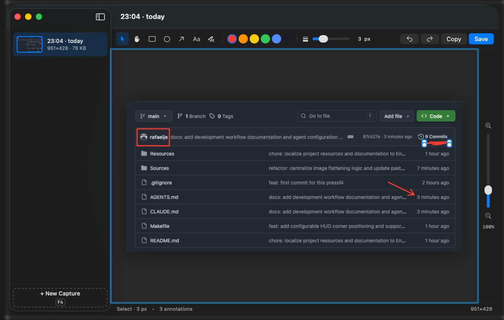

# PressF4

Native macOS app to capture screen areas, show thumbnails, and annotate them. Lives in the menu bar, invoked with **F4**.



- Language: **Swift 5.9 / SwiftUI / AppKit**
- Target: **macOS 14+** (Sonoma or later)
- Capture: native **ScreenCaptureKit**
- Global shortcuts: **Carbon HotKey API** (no external dependencies)
- Sandbox: **full**, ad-hoc signed for local use

## Requirements

- macOS 14.0 (Sonoma) or later
- Xcode 15+ installed (only for `swiftc` / `codesign`; no Xcode project is used)

## Build

```bash
cd pressf4
make          # compile, assemble .app, ad-hoc sign with entitlements
make test     # XCTest suite over the pure model logic (wraps `swift test`)
make run      # build + open the app
make install  # copy to /Applications
make clean
```

The binary lands at `build/pressf4.app`.

`make test` delegates to SwiftPM (`swift test`). The `Package.swift` at the project
root exposes only `Sources/Models/` as the library `PressF4Core`; the AppKit /
ScreenCaptureKit / SwiftUI surface area lives in `Sources/Services` and
`Sources/Views` and is built exclusively through the Makefile + `swiftc`. Tests
live under `Tests/PressF4CoreTests/`, one `XCTestCase` per unit.

## First launch — permissions

1. On the first capture attempt, macOS will prompt for **Screen Recording permission**.
   - Accept the prompt or go to *System Settings → Privacy & Security → Screen Recording* and enable "PressF4".
   - Reopen the app after granting permission.
2. macOS will also ask for notification permission (optional — you can deny it).

## Default shortcuts

| Action | Shortcut |
|---|---|
| Capture area | `F4` |
| Show main window | `⌃⌥⌘ H` |
| Open last capture in editor | `⌃⌥⌘ E` |
| Copy annotated image (editor) | `⌘ C` |
| Save annotated image (editor) | `⌘ S` |
| Undo / redo (editor) | `⌘ Z` / `⇧⌘ Z` |
| Delete selected annotation | `⌫` |
| Zoom in / out / reset (editor) | `⌘ =` / `⌘ -` / `⌘ 0` |

> ⚠️ **About F4 on Mac**: by default macOS uses F-keys for hardware functions. Enable *System Settings → Keyboard → "Use F1, F2, etc. keys as standard function keys"* so F4 triggers the capture directly; otherwise you'll need to press `Fn+F4`.

## How to use

1. Press `F4`. The screen dims and the crosshair appears.
2. Drag to select the area. Release to capture. `Esc` cancels.
3. A floating thumbnail appears in the bottom-right for 4 seconds.
   - Click the thumbnail → open the editor.
   - ✎ button → editor. ⧉ button → copy to clipboard.
4. The capture is already copied to the clipboard automatically.
5. In the editor: pick a tool (select, pan, rectangle, circle, arrow, text, freehand), color, thickness; drag to create; `⌫` removes the selected annotation; `⌘Z` undoes, `⇧⌘Z` redoes.
6. `⌘C` copies with the annotations applied; `⌘S` saves to a file. Zoom with `⌘=` / `⌘-` / `⌘0`.

## Where captures are stored

`~/Library/Containers/com.rafaelje.pressf4/Data/Library/Application Support/PressF4/`

Inside you'll find:
- `<uuid>.png` — the original image without annotations
- `<uuid>.json` — annotations as an editable layer (can be modified later)
- `index.json` — master index

Annotations are **editable objects**, not pixels flattened onto the PNG. When saving with `⌘S` or copying with `⌘C`, they are flattened into the final render.

## Architecture

```
Sources/
├── App.swift                       # @main + AppDelegate + AppController
├── Models/                         # also published as the PressF4Core SwiftPM library
│   ├── Capture.swift               # Individual capture
│   ├── Annotation.swift            # Types, colors, layer
│   ├── CaptureGeometry.swift       # Pure crop/coordinate math
│   ├── EditorTransforms.swift      # Pure resize / move transforms
│   └── LayerHistory.swift          # Bounded undo/redo stack
├── Services/
│   ├── CaptureService.swift        # ScreenCaptureKit wrapper
│   ├── LibraryStore.swift          # Local persistence
│   └── ShortcutsManager.swift      # Global Carbon hotkeys
└── Views/
    ├── SelectionOverlay.swift      # Full-screen selection overlay
    ├── ThumbnailHUD.swift          # Post-capture floating thumbnail
    ├── EditorView.swift            # Canvas + tools
    └── MainWindow.swift            # NSSplitView with sidebar

Tests/PressF4CoreTests/             # XCTest target wired through Package.swift
├── CaptureTests.swift
├── AnnotationTests.swift
├── CaptureGeometryTests.swift
├── EditorTransformsTests.swift
└── LayerHistoryTests.swift
```

## Technical notes

- **LSUIElement=true**: the app lives in the menu bar; the dock icon only appears while the main window is open.
- **Multi-monitor**: `SelectionOverlay` is installed on every `NSScreen` and capture automatically detects the display containing the rectangle.
- **Sandbox**: captures are stored inside the sandbox container; "Save As…" uses `NSSavePanel`, which grants access to the user-chosen destination.
- **Ad-hoc signing**: sufficient for local use. Distribution would require Developer ID + notarization.

## Uninstall

```bash
rm -rf /Applications/pressf4.app
rm -rf ~/Library/Containers/com.rafaelje.pressf4
```

(And revoke Screen Recording permission in System Settings.)

## Reassigning shortcuts

For V1 simplicity, shortcuts are hardcoded in `Sources/Services/ShortcutsManager.swift`. To change them, edit the `keyCode` values and recompile. A Preferences UI is planned for V2.
